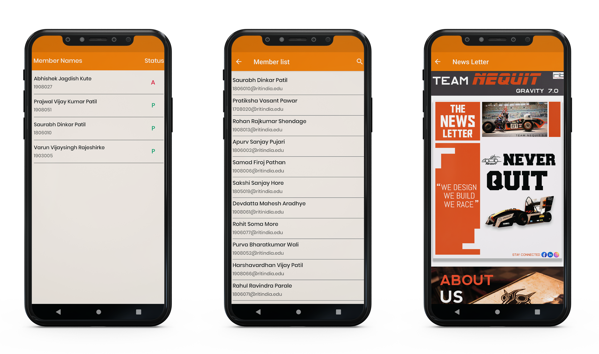
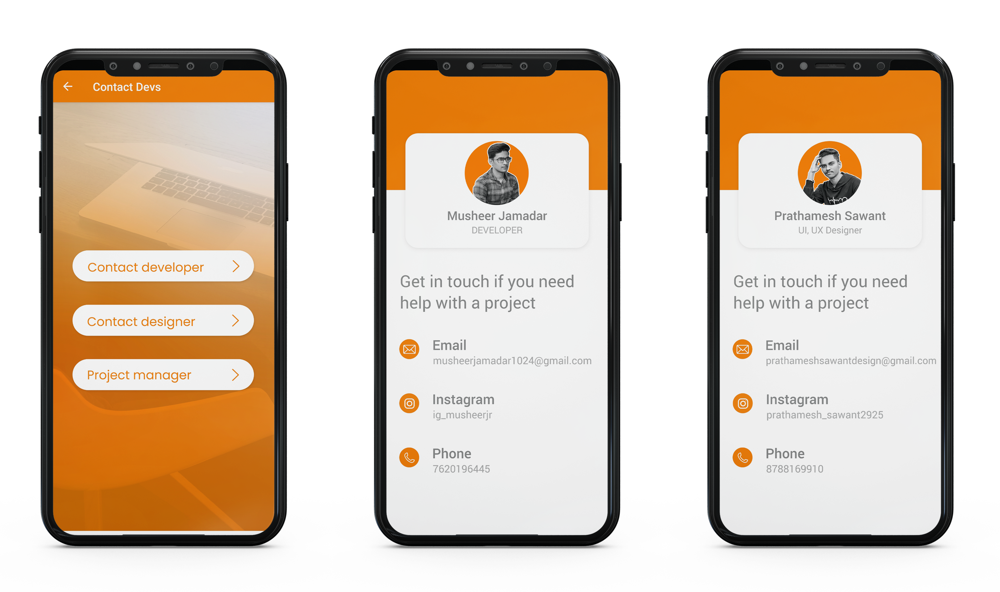

 
  

&#xa0;

  <!-- <a href="https://e_commerce_app_flutter.netlify.app">Demo</a> -->

<h1 align="center">Team Nequit App</h1>

## Status

<h4 align="center">
	Completed
</h4>

  <a href="#dart-about">About</a> &#xa0; | &#xa0; 
  <a href="#sparkles-features">Features</a> &#xa0; | &#xa0;
  <a href="#checkered_flag-illustrations">Illustrations</a> &#xa0; | &#xa0;
  <a href="https://github.com/MusheerJ" target="_blank">Author</a>

 

## :dart: About

This is an Activities Management Application developed using AndroidFire(Android+Firebase). This Application is specially developed for team-nequit for managing and monitoring their work and activities.
## :sparkles: Features

:heavy_check_mark: User Authentication\
:heavy_check_mark: Password Resetting\
:heavy_check_mark: Adding/Updating Attendance\
:heavy_check_mark: Polls\
:heavy_check_mark: List of Members\
:heavy_check_mark: Feedbacks\
:heavy_check_mark: Manage User Profile

## :checkered_flag: Illustrations

Here are some Illustration of App Screens

|  |
| :--------------------------------:| 
|            Authentication         |

|  |
| :--------------------------------:| 
|            Home         |

|  |
| :--------------------------------:| 
|            Poll       |

|  |
| :--------------------------------:| 
|            Attendace         |

|  |
| :--------------------------------:| 
|            Contact       |

